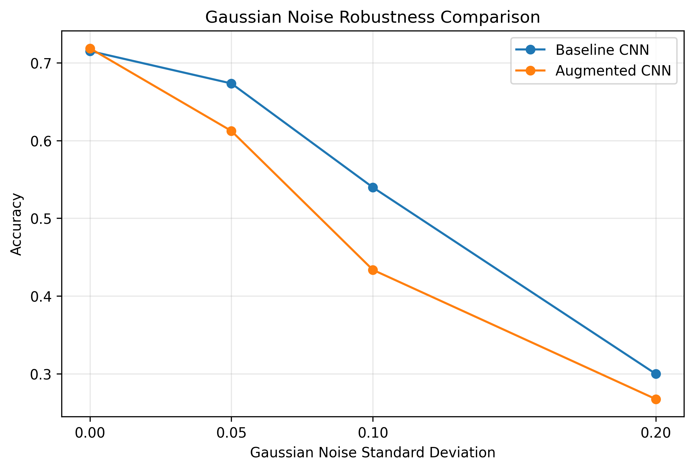
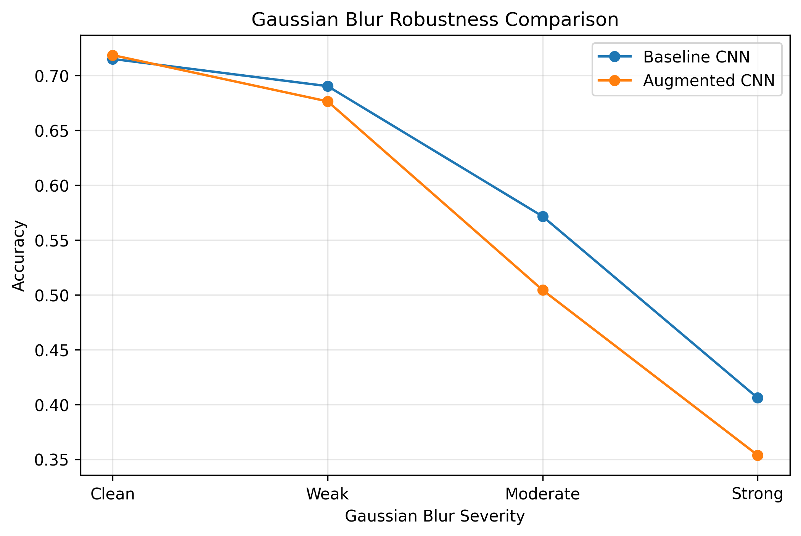
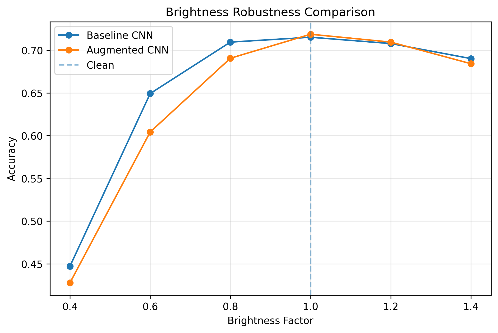
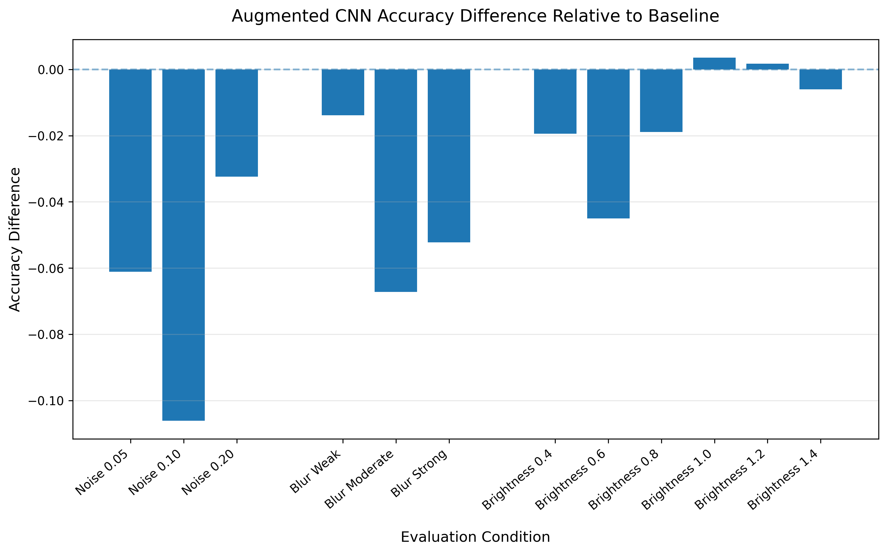

# CNN Robustness and Generalization under Image Corruption

This project investigates whether standard geometric data augmentation improves the robustness of a convolutional neural network to unseen image corruptions that were not explicitly included during training.

A baseline CNN and an augmented CNN are trained on CIFAR-10 using the same architecture and training configuration. The augmented model is trained with random cropping and horizontal flipping, while both models are evaluated under identical clean and corrupted test conditions.

The robustness analysis focuses on three corruption types:

- Gaussian noise
- Gaussian blur
- Brightness shifts


## Research Question

Can standard geometric data augmentation improve a CNN's robustness to unseen image corruptions while maintaining clean classification performance?


## Dataset

The experiments use the CIFAR-10 dataset, which contains 60,000 color images across 10 classes.

The original training set was split into:

- 45,000 training images
- 5,000 validation images

The standard 10,000-image test set was used for final clean and corruption evaluation.

Images were normalized using channel statistics computed from the original 50,000-image CIFAR-10 training split before the train-validation split:

- Mean: `[0.4914, 0.4822, 0.4465]`
- Standard deviation: `[0.2470, 0.2435, 0.2616]`

## Model Architecture

Both experiments use the same convolutional neural network architecture so that differences in robustness can be attributed to the training augmentation rather than changes in model capacity.

The network consists of two convolutional blocks followed by a fully connected classifier:

| Layer | Configuration |
|---|---|
| Convolution 1 | `3 → 32` channels, `3×3` kernel, padding 1 |
| Activation | ReLU |
| Pooling | `2×2` max pooling |
| Convolution 2 | `32 → 64` channels, `3×3` kernel, padding 1 |
| Activation | ReLU |
| Pooling | `2×2` max pooling |
| Fully Connected | `4096 → 128` |
| Activation | ReLU |
| Dropout | `0.3` |
| Output | `128 → 10` |

The model outputs one logit for each CIFAR-10 class and is trained using cross-entropy loss with the Adam optimizer.


## Experimental Design

Two CNNs were trained using the same architecture, train-validation split, optimizer, learning rate, number of epochs, and model-selection criterion.

The only intentional difference between the two training pipelines was the use of geometric data augmentation.

| Setting | Baseline CNN | Augmented CNN |
|---|---|---|
| Architecture | Same CNN | Same CNN |
| Training images | Normalized only | Random crop + horizontal flip + normalization |
| Validation images | Normalized only | Normalized only |
| Optimizer | Adam | Adam |
| Learning rate | `0.001` | `0.001` |
| Epochs | `10` | `10` |
| Batch size | `128` | `128` |
| Model selection | Lowest validation loss | Lowest validation loss |

The augmented model used `RandomCrop(size=32, padding=4)` and `RandomHorizontalFlip()` during training. These transformations were not applied to the validation or test sets.

Neither model was trained using Gaussian noise, Gaussian blur, or brightness shifts. These corruptions were introduced only during evaluation so that the experiment could test whether robustness learned from standard geometric augmentation transferred to unseen corruption types.


## Corruption Evaluation

Robustness was evaluated on the CIFAR-10 test set under three types of synthetic image corruption.

| Corruption | Evaluated Severities |
|---|---|
| Gaussian noise | Standard deviation `0.05`, `0.10`, `0.20` |
| Gaussian blur | Weak: `kernel_size=3, sigma=0.5`; Moderate: `kernel_size=3, sigma=1.0`; Strong: `kernel_size=5, sigma=1.5` |
| Brightness shift | Factors `0.4`, `0.6`, `0.8`, `1.0`, `1.2`, `1.4` |

For each corruption condition, the baseline and augmented CNNs were evaluated on the same transformed test images. Clean test performance was also measured to provide a reference for robustness degradation.

## Results

### Clean Performance

The two models achieved nearly identical performance on the clean CIFAR-10 test set.

| Model | Test Loss | Test Accuracy |
|---|---:|---:|
| Baseline CNN | `0.8143` | `71.52%` |
| Augmented CNN | `0.8085` | `71.87%` |

The augmented CNN improved clean test accuracy by only `0.35` percentage points, indicating that random cropping and horizontal flipping largely preserved clean classification performance.


### Gaussian Noise

| Noise Std | Baseline Accuracy | Augmented Accuracy | Difference |
|---:|---:|---:|---:|
| `0.05` | `67.35%` | `61.24%` | `-6.11 pp` |
| `0.10` | `53.98%` | `43.37%` | `-10.61 pp` |
| `0.20` | `29.98%` | `26.74%` | `-3.24 pp` |

The augmented CNN achieved lower accuracy at all three Gaussian noise levels. The largest gap occurred at `std=0.10`, where the augmented model underperformed the baseline by `10.61` percentage points.


### Gaussian Blur

| Severity | Baseline Accuracy | Augmented Accuracy | Difference |
|---|---:|---:|---:|
| Weak | `69.04%` | `67.65%` | `-1.39 pp` |
| Moderate | `57.16%` | `50.44%` | `-6.72 pp` |
| Strong | `40.60%` | `35.38%` | `-5.22 pp` |

The performance difference was small under weak blur but became more pronounced at moderate and strong blur levels.


### Brightness Shifts

| Brightness Factor | Baseline Accuracy | Augmented Accuracy | Difference |
|---:|---:|---:|---:|
| `0.4` | `44.73%` | `42.79%` | `-1.94 pp` |
| `0.6` | `64.93%` | `60.43%` | `-4.50 pp` |
| `0.8` | `70.95%` | `69.06%` | `-1.89 pp` |
| `1.0` | `71.52%` | `71.87%` | `+0.35 pp` |
| `1.2` | `70.78%` | `70.95%` | `+0.17 pp` |
| `1.4` | `69.02%` | `68.42%` | `-0.60 pp` |

Both models were relatively stable near the clean brightness condition. However, the augmented model showed lower accuracy under darker conditions, particularly at a brightness factor of `0.6`.


## Key Findings

Random cropping and horizontal flipping maintained approximately the same clean test performance as the baseline training pipeline, but they did not improve robustness to the evaluated unseen corruptions.

The augmented CNN performed worse than the baseline under every evaluated Gaussian noise and Gaussian blur condition and under most brightness shifts. These results suggest that invariance learned from standard geometric augmentation does not necessarily transfer to robustness against unrelated pixel-level or intensity-based distribution shifts.

## Robustness Visualizations

### Gaussian Noise



The models begin with nearly identical clean performance, but the augmented CNN degrades more rapidly as Gaussian noise increases.


### Gaussian Blur



The performance gap is relatively small under weak blur and becomes more pronounced under moderate and strong blur.


### Brightness Shifts



Both models remain relatively stable around the original brightness level, while the augmented model shows greater performance degradation as images become darker.


### Overall Comparison



Across most evaluated corruption conditions, the augmented CNN achieved lower accuracy than the baseline despite maintaining comparable clean test performance.

## Limitations

This study uses a single CNN architecture, one dataset, and one training run for each model. Because neural network training and random data augmentation are stochastic, repeated experiments across multiple random seeds would be needed to determine how stable the observed performance differences are.

The augmentation strategy is also limited to random cropping and horizontal flipping, while robustness is evaluated using only Gaussian noise, Gaussian blur, and brightness shifts. The results therefore should not be interpreted as evidence that data augmentation generally reduces corruption robustness.

Instead, the findings are specific to the model, augmentation strategy, dataset, and corruption settings evaluated in this project.

## Repository Structure

```text
cnn-robustness-generalization/
├── notebooks/
│   ├── 01_data_exploration.ipynb
│   ├── 02_baseline_cnn_training.ipynb
│   ├── 03_corruption_evaluation.ipynb
│   ├── 04_augmentation_training.ipynb
│   └── 05_robustness_comparison.ipynb
├── results/
│   ├── gaussian_noise_comparison.png
│   ├── gaussian_blur_comparison.png
│   ├── brightness_comparison.png
│   └── overall_robustness_summary.png
├── README.md
├── requirements.txt
├── LICENSE
└── .gitignore
```

The notebooks follow the experimental workflow from data exploration and baseline training through corruption evaluation, augmentation training, and the final robustness comparison.

The `data/` and `models/` directories are excluded from version control. CIFAR-10 data and trained model checkpoints are stored locally and are not included in the repository.

## How to Run

Run the notebooks in the following order:

1. `01_data_exploration.ipynb`  
   Explore CIFAR-10 and compute image normalization statistics.

2. `02_baseline_cnn_training.ipynb`  
   Train the baseline CNN and save the checkpoint with the lowest validation loss.

3. `03_corruption_evaluation.ipynb`  
   Evaluate the baseline CNN under Gaussian noise, Gaussian blur, and brightness shifts.

4. `04_augmentation_training.ipynb`  
   Train the same CNN architecture using random cropping and horizontal flipping, and save the checkpoint with the lowest validation loss.

5. `05_robustness_comparison.ipynb`  
   Load the baseline and augmented checkpoints and compare both models under identical clean and corrupted test conditions.

The project requires Python with PyTorch, torchvision, NumPy, scikit-learn, Matplotlib, and Jupyter installed.

The CIFAR-10 dataset and trained model checkpoints are stored locally and are not tracked by Git.

## Requirements

The project uses the following main Python packages:

- PyTorch
- torchvision
- NumPy
- pandas
- Matplotlib
- scikit-learn
- Jupyter

Install the required packages with:

```bash
pip install -r requirements.txt
```

## Future Work

Future work could extend the current experiments in several directions:

- Repeat training across multiple random seeds to evaluate the stability of the observed robustness differences.
- Investigate corruption-aware augmentation strategies that explicitly include noise, blur, or brightness variation during training.
- Compare the results with stronger CNN architectures such as ResNet.
- Evaluate robustness on additional datasets and a broader range of image corruptions.